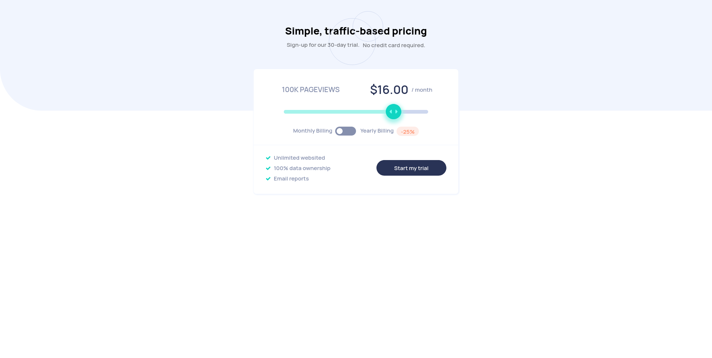

# Frontend Mentor Challenge - interactive-pricing-component
  - [The Challange](https://www.frontendmentor.io/challenges/interactive-pricing-component-t0m8PIyY8)

## Table of contents

- [Overview](#overview)
  - [The challenge](#the-challenge)
  - [Screenshot](#screenshot)
  - [Links](#links)
- [My process](#my-process)
  - [Built with](#built-with)
  - [What I learned](#what-i-learned)
  - [Useful resources](#useful-resources)

### Screenshot




### Links

- Solution URL: [Solution]())
- Live Site URL: [Live Site]())

## My process

### Built with

- Semantic HTML5 markup
- CSS custom properties
- Flexbox
- CSS Grid
- Mobile-first workflow

### What I learned
 - I learned how to use grid-template-areas
  
  ```css
      .grid {
        display: grid;
        grid-template-areas: "a a"
                             "a b"
                             "c c";
        grid-template-columns: repeat(2, auto);
        grid-template-rows: repeat(3, auto);
      }
      
      .box1 {
        grid-area: a;
      }
      
      .box2 {
        grid-area: b;
      }
      
      .box3 {
        grid-area: c;
      }
  ```
  
  ```
   ---------
   |   a   |
   ---------
   | a | b |
   ---------
   |   c   |
   ---------
  ```

  - creating a custom elements 
    1. checkbox
    3. slider
      - I took sometime creating this one, I learnt you can use these properties to style
        the elements into your own liking.
        
        ```
          -webkit-slider-runnable-track
          -webkit-slider-thumb
          
          -moz-range-track
          -moz-range-progress
          -moz-range-thumb
          
          -ms-fill-lower
          -ms-track
          -ms-thumb
          -ms-tooltip
        ```
